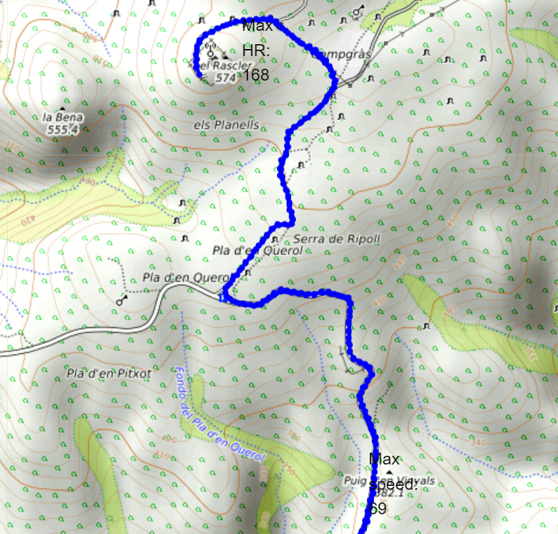

# GPX file reading and datascience

Sports apps usually provide limited options for reading and processing GPX data.
This Notebook reproduces some basic functionalities of such apps and adds some extra ones, providing a basis for further work. Some of its features are:

- Reading a GPX file and loading its data into a Pandas dataframe
- Calculating some common parameters such as:
   - Cumulative time
   - Cumulative distance
   - Velocity (raw and smoothed)
   - Slope (raw and smoothed)
   - Elevation (raw and smoothed)
   - Cumulative elevation
- Removal of velocity outliers
- Calculating some statistics such as:
   - Total time
   - Total distance
   - Maximum velocity
   - Average velocity
   - Maximum slope
   - Maximum heart rate
   - Minimum heart rate
   - Maximum height
   - Minimum height
   - Total accumulated elevation
- Reading app-stored statistics from the file
- Interactive plots of any parameter as a function of time or distance
- Scatter plots of heart trate vs velocity and slope vs velocity
- Conconi test plot for determining aerobic and anaerobic thresholds. It is essentially a heart rate/velocity plot for a specified part of the track for which velocity was increased stepwise while cycling (or running) on a horizontal and homogeneous terrain.
- Interactive plot of the track on a map. Maximum speed and heart rate are displayed at the location where they were reached. Cumulative time, cumulative distance, instantaneous speed, and instantaneous slope can also be displayed by clicking any point on the track.
- Trimming the track from a specified time on. This is useful for removing that undesired final part, sometimes mistakenly recorded after finishing the actual route.

An online version of the notebook can be run directly in [colab](https://colab.research.google.com/github/RSPdatascience/GPX-datascience/blob/master/GPX2df-Colab.ipynb)

